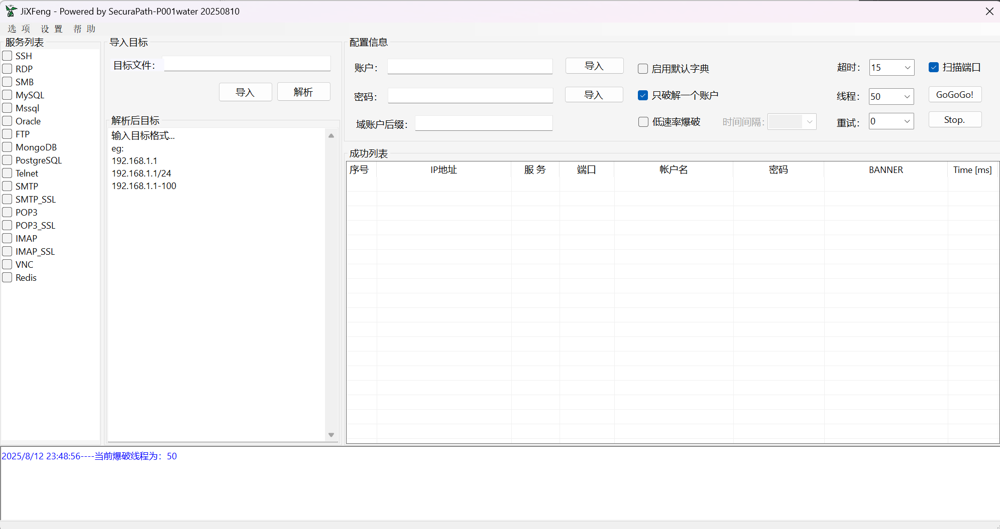
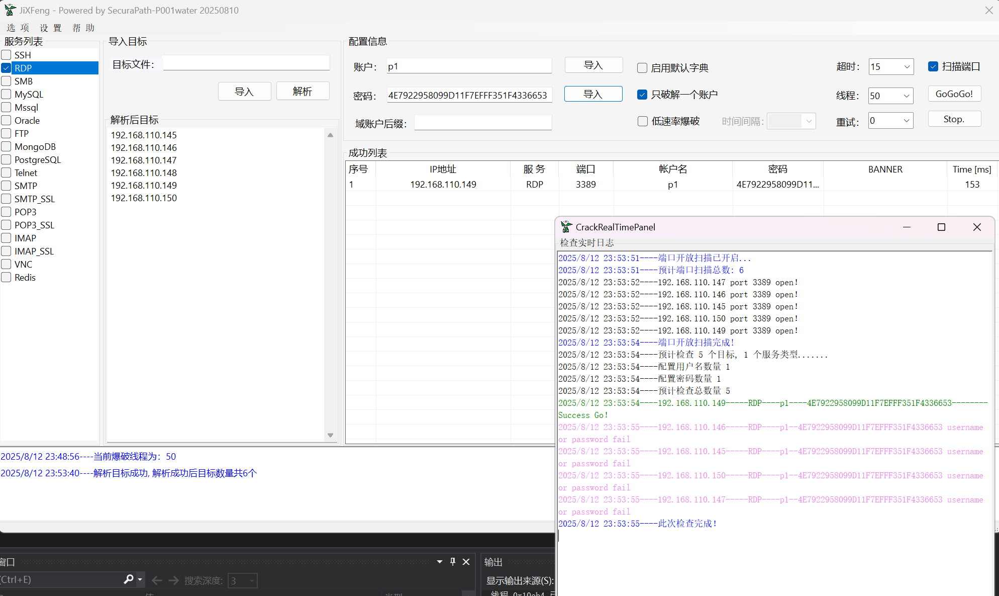

# JiXFeng - 急先锋

```
安全漫道.team开发维护的一款图形化常见协议弱口令检测工具
Powerby P001water & SongXY
```


## 界面参考如下

```
1. 20250810 首发公开测试版本
```



## 支持协议和功能特色

从原理的角度，这种弱口令检测工具很难老树生新花了，`JiXFeng`支持的协议如下

```
SSH
RDP (RDP 支持NTLM Hash验证)
SMB
MySQL
Mssql
Oracle
FTP
MongoDB
PostgreSQL
Telnet
SMTP
SMTP_SSL
POP3
POP3_SSL
IMAP
IMAP_SSL
VNC
Redis
```

笔者从协议上实现了RDP的验证过程，`JiXFeng`的RDP检测支持NTLM验证，教程参考使用示例即可


## 使用示例

```
1. 导入文件或者输入目标格式后，点击解析，会解析CIDR格式
2. 从服务列表选择协议
3. 配置用户名密码字段
4. GoGoGo！开始检测

图形化的界面，功能方便直观，多多探索即可
```




## 工具地址和Bug反馈

工具地址：

```
https://github.com/P001water/JiXFeng
```

Bug反馈：

```
1. 提交Gihub 提交Issues
2. 后台私信作者
```


## 致谢

JiXFeng工具研发之初，借鉴和学习了SNETCracker的设计页面和代码，在这里向SNETCracker致敬


## 开启知识星球计划

技术是我们的月光，三便士又不可或缺，为了让我和我的工具走的更远，我决定开始运营我的知识星球了

预期星球运营的内容包括一些渗透经验和自用工具，JiXFeng也规划在其中。
后续可能更新发布一些exchange、365邮件收取工具、代理池工具、exchange的gui爆破工具等等

如果你使用过和认可我的一些其他工具，如P1finger、P1soda等，赶快加入吧，星球暂定价格`66￥/年`
价格随着工具的数量和内容的增加而提升，早鸟不亏：）


感谢各位老哥的支持。做星球，我们努力的方向是做好内容，让良币驱逐劣币。

